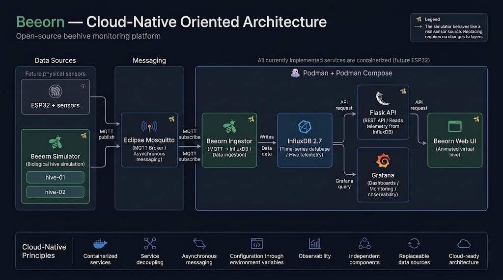
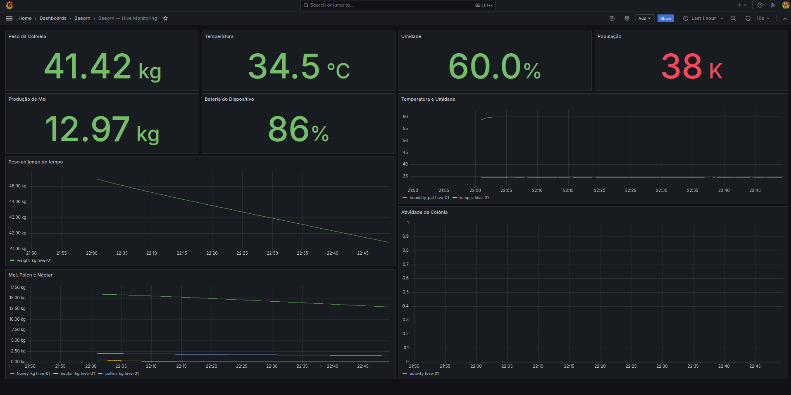
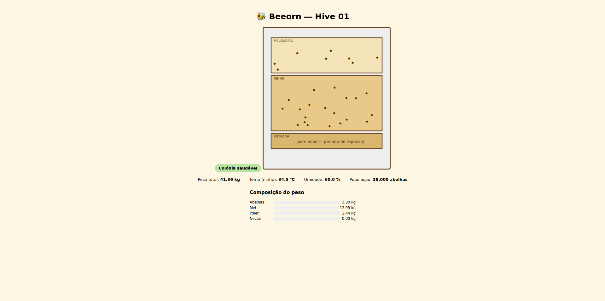
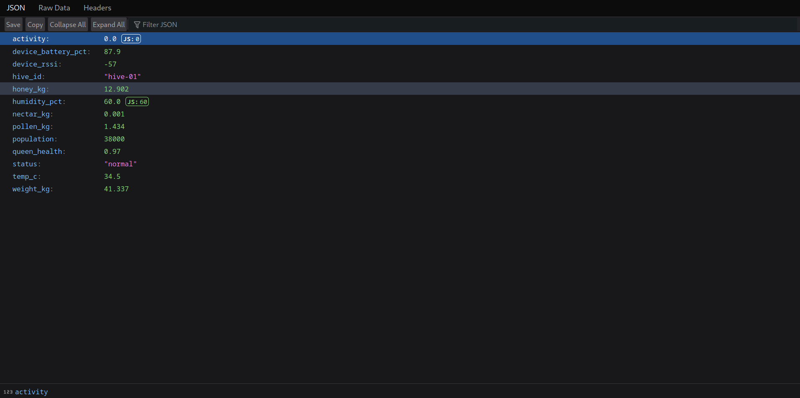
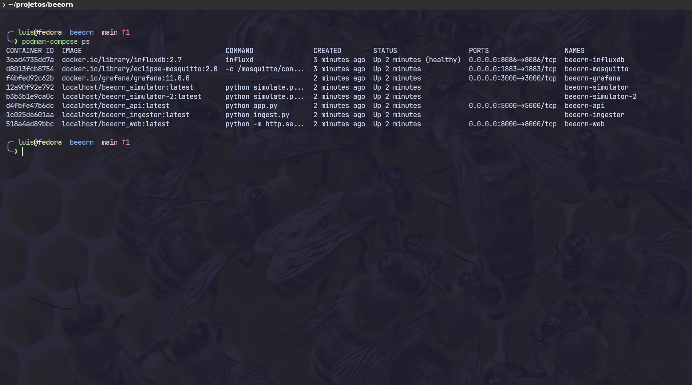

# 🐝 Beeorn

**Beeorn** is a beehive monitoring platform built as an infrastructure
and observability proof of concept --- not a data science or hardware
project.

It simulates a biologically plausible bee colony, streams telemetry over
MQTT, stores it as time-series data, and exposes it through a REST API,
a Grafana observability stack, and an animated web UI.

The system currently runs entirely on simulated data. No physical
hardware is connected yet. The architecture, however, was deliberately
built so that a real hive sensor --- such as an ESP32 with load cells
and temperature/humidity probes --- could replace the simulator
**without changing anything downstream**: the same broker, ingestion
service, storage, dashboards, and API remain in place.

------------------------------------------------------------------------

## Why this project exists

Beehive loss from swarming, overheating, or dwindling food reserves is
often detected too late --- by the time a beekeeper notices, the damage
is done.

Continuous monitoring is a real precision-beekeeping use case. Beeorn
uses that problem as a vehicle to build and demonstrate a proper
**distributed, message-driven, containerized monitoring architecture**,
end to end: from data generation to storage, API exposure,
visualization, and alerting.

The focus here is intentionally on **infrastructure, observability,
distributed systems design, and cloud-oriented architecture** --- not on
beekeeping science or embedded firmware.

------------------------------------------------------------------------

## Open source, top to bottom

Beeorn is built entirely on open-source technologies. There is no
dependency on a proprietary or paid service to run the full stack
locally:

  Layer                 Technology
  --------------------- ---------------------------------
  Language / services   Python
  Web API               Flask
  Messaging             Eclipse Mosquitto (MQTT broker)
  Storage               InfluxDB (time series)
  Observability         Grafana
  Containerization      Podman + Podman Compose
  Web UI                HTML / JavaScript (Canvas)

Anyone can clone the repository and reproduce the entire environment
locally using free and open tooling.

------------------------------------------------------------------------

## Cloud Native principles, applied locally

Beeorn is **not deployed to a public cloud today** --- it runs on a
local machine via Podman Compose.

That said, it was deliberately designed around Cloud Native
architectural principles, so that moving it toward a managed cloud
environment can be approached primarily as an infrastructure and
deployment evolution rather than a complete application redesign.

-   **Containerized services** --- every component (simulator, ingestor,
    API, web UI, broker, database, dashboard) runs in its own container.
-   **Decoupled, single-responsibility services** --- generation,
    transport, ingestion, storage, API, and visualization are separate
    services.
-   **Asynchronous, event-driven communication** --- the simulator
    publishes telemetry to MQTT; it has no knowledge of InfluxDB or any
    consumer. The Ingestor is the only service that subscribes and
    persists data.
-   **Stateless application services** --- the simulator, ingestor, and
    API hold no persistent application state of their own; persistent
    state belongs in dedicated infrastructure components.
-   **Declarative, reproducible infrastructure** --- the entire
    eight-service stack is defined in a single `docker-compose.yml` and
    can be recreated through Podman Compose.
-   **Externalized configuration** --- credentials and connection
    settings live in environment variables (`.env`), not in source code.
-   **Built-in observability** --- metrics flow into a time-series
    database and are visualized and alerted on through Grafana.
-   **Independent replaceability** --- components communicate through
    well-defined interfaces such as MQTT topics, HTTP, and InfluxDB.
-   **Horizontal scalability path** --- adding another hive can be
    represented by another simulator instance or another sensor node
    publishing to the same broker.

In short: **Cloud Native here describes the architectural discipline the
project follows, not its current hosting environment.**

------------------------------------------------------------------------

## Architecture



The architecture separates telemetry generation from transport,
ingestion, storage, API access, and observability.

The **simulator has no knowledge of the database** --- it only publishes
JSON messages to MQTT, exactly like a physical sensor node would.

The **Ingestor is the only component that talks to InfluxDB**. This
separation allows the simulator to eventually be replaced by real ESP32
hardware without requiring changes to the downstream services.

### Component responsibilities

  -----------------------------------------------------------------------
  Service                             Role
  ----------------------------------- -----------------------------------
  `simulator` / `simulator-2`         Model the internal biological state
                                      of hive-01 and hive-02 and publish
                                      telemetry to MQTT

  `mosquitto`                         MQTT broker --- the communication
                                      channel between data producers and
                                      the rest of the system

  `ingestor`                          Subscribe to MQTT, validate
                                      messages, and write readings to
                                      InfluxDB

  `influxdb`                          Time-series storage for all hive
                                      metrics

  `api`                               Expose stored data through a Flask
                                      REST API

  `web`                               Serve the animated virtual hive,
                                      driven by the API

  `grafana`                           Dashboards, fleet comparison, and
                                      threshold-based alerting
                                      
  -----------------------------------------------------------------------

All eight services run as containers via **Podman**.

``` bash
podman-compose up -d --build
```

------------------------------------------------------------------------

## What the simulator models

Weight, temperature, and humidity are not random numbers --- they are
the **output** of an internal colony state.

The simulator models:

-   Population
-   Honey, pollen, and nectar reserves
-   Queen health
-   Daily colony activity
-   Foraging cycles
-   Total hive weight
-   Device battery and signal information
-   Swarming events with lasting effects on population and weight

A realistic daily cycle is simulated:

-   Foragers leave in the morning and hive weight drops
-   Foragers return during the afternoon and hive weight rises
-   Nectar gradually cures into honey overnight

Total hive weight is derived from multiple components:

**empty box + wax + bees + honey + pollen + nectar**

Swarming is also modeled as a real colony-state event, producing lasting
changes to population and weight rather than simply creating a temporary
visual effect.

------------------------------------------------------------------------

## Screenshots

### Fleet dashboard --- Grafana

Stat panels show each hive's current status at a glance, while
time-series panels expose historical trends and fleet telemetry.



### Virtual hive

Animated web view reacting to the colony's real state --- including
activity level, population, and alerts.



### REST API

The Flask API exposes the latest hive telemetry as JSON for the web
interface and other potential consumers.



### Containerized infrastructure

All eight services running through Podman Compose.



------------------------------------------------------------------------

## Running locally

Requires:

-   [Podman](https://podman.io/)
-   Podman Compose

Clone the repository:

``` bash
git clone https://github.com/reisops/beeorn.git
cd beeorn
```

Create the environment file:

``` bash
cp .env.example .env
```

Adjust the values in `.env` as necessary, then start the complete stack:

``` bash
podman-compose up -d --build
```

Once the stack is running:

  Service        URL
  -------------- -----------------------------------
  Grafana        `http://localhost:3000`
  Virtual hive   `http://localhost:8000`
  API            `http://localhost:5000/api/hives`
  InfluxDB       `http://localhost:8086`

Grafana credentials are defined through the local `.env` configuration.

------------------------------------------------------------------------

## Real problems solved along the way

Documented because debugging these problems was more valuable than any
single piece of code:

-   **SELinux blocking Grafana's volume** (`permission denied` on
    provisioning) --- fixed with the `:Z` flag on the appropriate
    Compose volume.
-   **Fedora + DNF5** --- the old `dnf config-manager --add-repo` syntax
    no longer works in the same way; the environment was standardized
    around native Podman instead of Docker CE.
-   **InfluxDB schema type conflict** --- a field written as an integer
    in one run and a float in another caused `422 Unprocessable Entity`
    errors; explicit `float()` casts were introduced for numeric fields.
-   **`localhost` inside containers** --- once the Python services were
    containerized, `localhost` no longer pointed to the host; services
    were addressed using their Compose service names such as `mosquitto`
    and `influxdb`.
-   **Image rebuilds not automatically recreating containers** ---
    rebuilding an image did not always recreate the expected running
    container; explicit container recreation was required.
-   **Misindented YAML** --- a service was accidentally nested under
    `volumes:` instead of `services:`, causing the Compose configuration
    to fail with missing services.

These incidents became part of the project because the infrastructure
troubleshooting was as valuable as the application itself.

------------------------------------------------------------------------

## Roadmap / next steps

-   [ ] Validate the architecture with a real beekeeper partner
-   [ ] Replace the simulator with ESP32 + physical sensors
-   [ ] CI/CD pipeline with GitHub Actions running lint and tests on
    every commit
-   [ ] Unit tests for the simulator's colony-state logic
-   [ ] Define a deployment path toward a managed cloud environment
-   [ ] Evaluate container orchestration and managed
    messaging/time-series services for a future cloud deployment

------------------------------------------------------------------------

## Author

**Luis Reis**

-   GitHub: [github.com/reisops](https://github.com/reisops)
-   Email: <luis.reis.cloud@tutamail.com>
