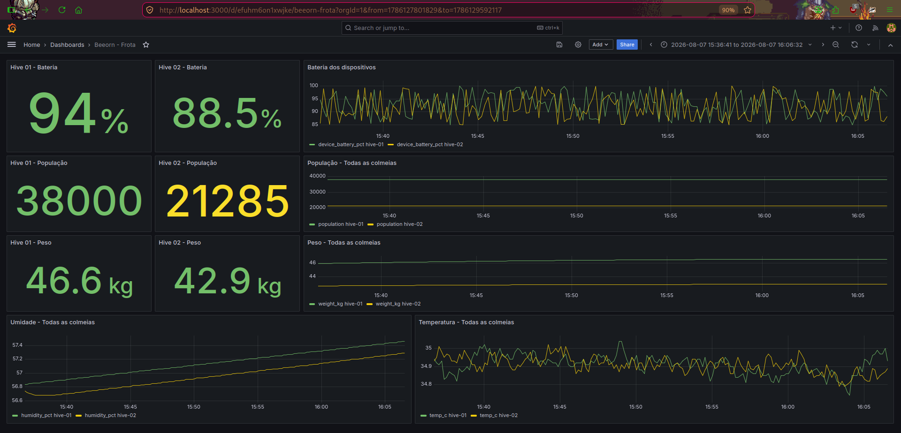
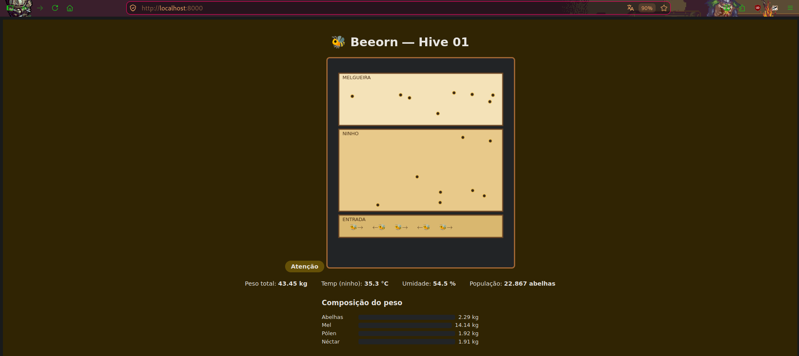
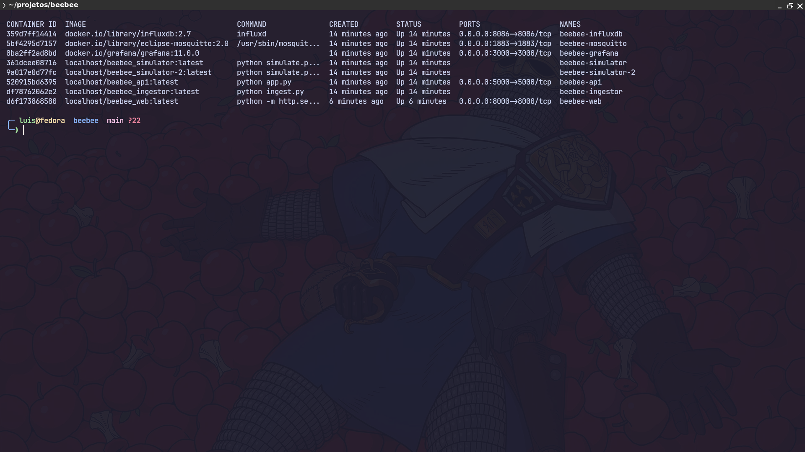
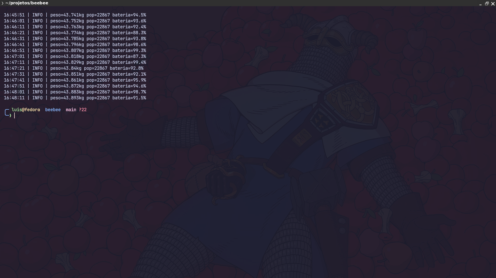
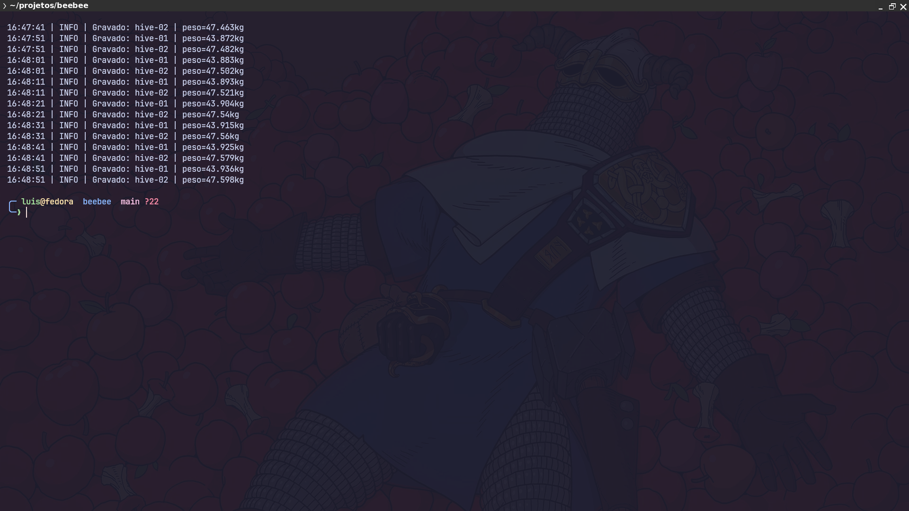

# 🐝 Beeorn

Beehive monitoring platform — biologically-modeled colony simulation, MQTT ingestion, time-series storage, and observability with Grafana. Architecture designed to migrate from simulated data to real physical sensors without rewriting anything.

> **Note:** the project doesn't use physical hardware yet — data is generated by a biologically plausible simulator, serving as a proof of concept for the full architecture before validating with a real beekeeper partner.

---

## Why this project exists

Beehive monitoring (weight, temperature, humidity) is a real precision-beekeeping problem — colony loss from swarming, overheating, or dwindling reserves is often detected too late. This project simulates that scenario end to end, from data generation to alerting, using the same architecture a real sensor system would use.

The project's focus is deliberately on **infrastructure, observability, and distributed architecture** — not on data science or embedded hardware.

---

## Architecture

┌─────────────┐ MQTT ┌────────────┐ write ┌───────────┐
│ Simulator │ ────────────▶ │ Mosquitto │ ─────────────▶ │ Ingestor │
│ (hive-01/02) │ publish │ (broker) │ subscribe │ │
└─────────────┘ └────────────┘ └─────┬─────┘
│ write
▼
┌────────────┐
│ InfluxDB │
│ (time │
│ series) │
└──────┬──────┘
┌───────────────┴───────────────┐
▼ ▼
┌────────────┐ ┌────────────┐
│ Flask API │ │ Grafana │
│ │ │ (dashboards │
└──────┬──────┘ │ + alerts) │
▼ └────────────┘
┌────────────┐
│ Web hive │
│ (animated) │
└────────────┘


The simulator **has no knowledge of the database** — it only publishes messages to MQTT, exactly like a physical sensor (ESP32) would. The Ingestor is the only component that talks to InfluxDB. This means replacing the simulator with real hardware requires no changes to the rest of the system.

All 8 services run as containers via **Podman** (`podman-compose up -d` brings up everything):

| Service | Role |
|---|---|
| `influxdb` | Time-series database |
| `mosquitto` | MQTT broker |
| `ingestor` | Subscribes to MQTT, writes to InfluxDB |
| `simulator` / `simulator-2` | Simulate hive-01 and hive-02 |
| `api` | Exposes data via REST (Flask) |
| `web` | Serves the animated virtual hive |
| `grafana` | Dashboards and alerting |

---

## Stack

Fully open source, no dependency on paid services:

- **Python** — simulator, ingestor, API (Flask)
- **MQTT (Eclipse Mosquitto)** — messaging between sensor and database
- **InfluxDB 2.7** — time-series database
- **Grafana** — dashboards and alerting
- **Podman + Podman Compose** — containerization (open source alternative to Docker)
- **HTML/JS (Canvas)** — animated virtual hive

---

## What the simulator models

Weight, temperature, and humidity aren't random numbers — they're a **consequence** of the colony's internal state:

- Population, honey/pollen/nectar reserves, queen health
- A realistic daily cycle (foragers leave in the morning, weight drops; return in the afternoon, weight rises; nectar cures into honey overnight)
- Total weight = empty box + wax + bees + honey + pollen + nectar (all variable)
- Random swarming event, with real impact on population and weight

---

## Screenshots

### Fleet dashboard (Grafana)
"Stat" panels at the top show each hive's status at a glance (green/yellow/red by threshold); line charts below show historical trends comparing both hives.



### Virtual hive
Web page with animated bees reacting to the colony's real state (activity, population, alerts).



### Containerized infrastructure
All 8 services running via `podman-compose up -d`.



### Simulator generating biological data
Real-time weight, population, and device battery readings — driven by the colony's internal state, not random numbers.



### Ingestor writing to InfluxDB
Confirms the MQTT → InfluxDB pipeline working end to end.



---

## Running locally

Requires [Podman](https://podman.io/).

```bash
git clone https://github.com/reisops/beeorn.git
cd beeorn
cp .env.example .env   # adjust values if you'd like
podman-compose up -d --build
```

Once it's up:

- Grafana dashboard: `http://localhost:3000` (default login: `admin` / password set in `.env`)
- Virtual hive: `http://localhost:8000`
- API: `http://localhost:5000/api/hives`

---

## Real problems solved along the way

Documented because debugging these was more valuable for learning than any single piece of code:

- **SELinux blocking Grafana's volume** (`permission denied` on provisioning) — fixed with the `:Z` flag on `docker-compose.yml` volumes
- **Fedora 44 + DNF5**: the old `dnf config-manager --add-repo` syntax no longer works, and Docker CE's official repo lacked immediate support for the release — fixed by migrating to native Podman
- **InfluxDB type conflict**: a field written as an integer in one run and as a float in another breaks writes (`422 Unprocessable Entity`) — fixed by forcing explicit `float()` on all numeric fields
- **`localhost` inside containers**: once the Python services were containerized, `localhost` stopped pointing to the host machine — fixed by using the Compose service names instead (`mosquitto`, `influxdb`)
- **Rebuilding an image doesn't auto-recreate the container** in Podman Compose — fixed with explicit `podman stop` + `podman rm` before bringing the new image up
- **Misindented YAML**: a service accidentally placed under the `volumes:` section instead of `services:` — Compose fails silently with "missing services"

---

## Roadmap / next steps

- [ ] Validate with a real beekeeper partner (replace the simulator with ESP32 hardware + sensors)
- [ ] CI/CD (GitHub Actions) running lint/tests on every commit
- [ ] Unit tests for the simulator's logic
- [ ] MQTT authentication (currently `allow_anonymous`, acceptable only in a local environment)

---

## Author

Luis — [GitHub](https://github.com/reisops)
